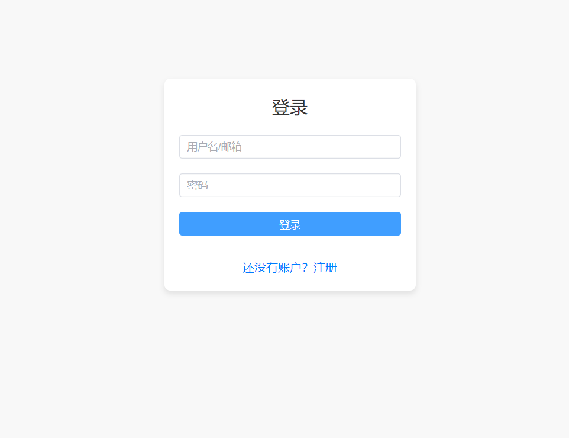
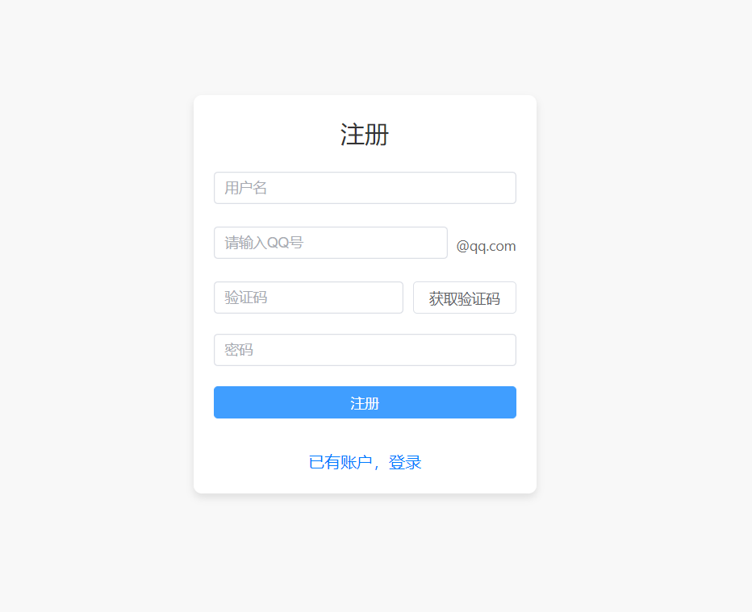
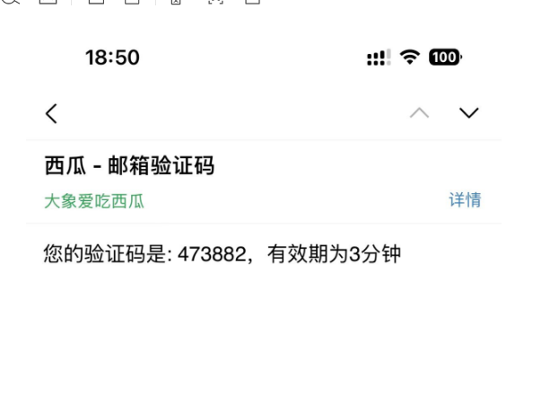
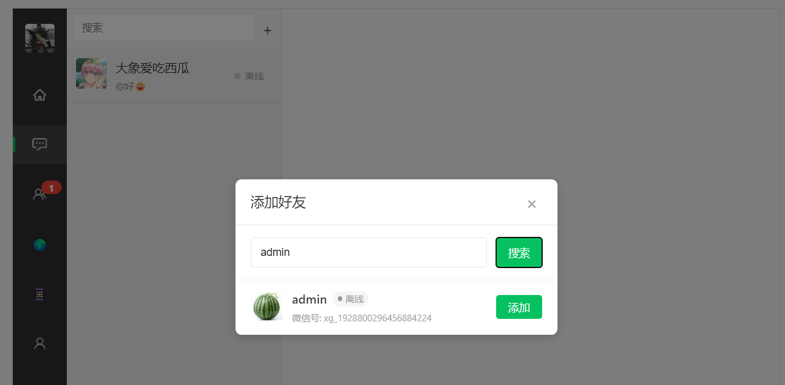
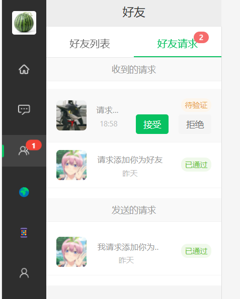
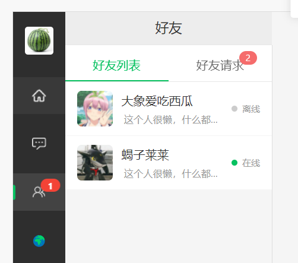
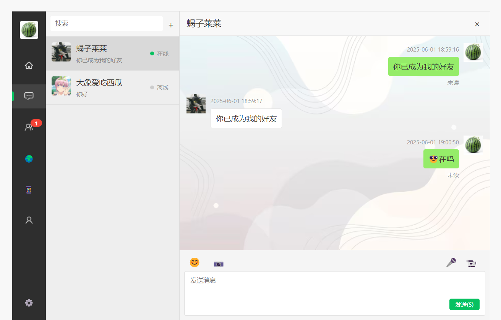
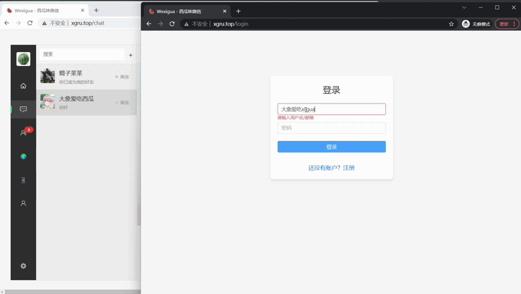

# 🍉Xigua-Cloud 项目介绍

📄 开源协议
本项目仅供学习交流使用，**❗禁止任何形式的商业用途❗** 。如需商用请联系作者获得授权

🔹 功能亮点
【💬 实时聊天】｜【👥 好友管理】｜【🟢 在线状态】｜【💾 消息持久化】｜【📧 邮箱验证】

🔧 技术栈
【☕ JDK 17 + 🌱 Spring Boot 3】｜【☁️ Spring Cloud Alibaba】｜【🔄 WebSocket】｜【📡 Dubbo】｜【❄️ 雪花算法】

## 项目概述
Xigua-Cloud 是一款网页版即时通讯应用，功能对标微信。它支持用户注册登录、邮箱验证、添加好友、处理好友验证请求、实时好友聊天等功能。同时，项目实现了消息持久化存储，能实时显示用户在线/离线状态，为用户提供流畅的在线聊天体验。

目前项目仍在持续开发中，更多功能（如群聊、音视频对话、搜索等）将在后续版本中陆续推出，欢迎持续关注和体验。


## 🌐 体验地址

- 前端页面入口：[http://xgru.top](http://xgru.top)

> ⚠️ **注意事项：**
>
> 1. 当前项目部署在小型服务器上，资源有限，无法承受高并发访问或大流量压力。
> 2. 请避免进行压力测试或频繁刷新/点击，体验功能为主。
> 3. 若希望获得更流畅的体验，建议自行拉取项目源码并本地部署运行。


## 🔑 体验账号

| 账号类型 | 用户名    | 密码       |
|----------|--------|------------|
| 普通用户 | admin  | 123456 |
| 普通用户 | 大象爱吃西瓜 | 123456 |


## 🧰技术栈
本项目采用了一系列先进的技术和框架，确保系统的高性能、可扩展性和易维护性，具体如下：

| 类别 | 技术/组件 | 描述说明 |
|------|----------|----------|
| 编程语言 | JDK 17 | Java 语言，采用长期支持（LTS）版本 |
| 应用框架 | Spring Boot 3.2.5 | 简化配置、快速开发的企业级框架 |
| 微服务架构 | Spring Cloud Alibaba（2023.0.1.0） | 支持服务注册、配置中心、服务治理等微服务能力 |
| API 网关 | Spring Cloud Gateway（4.1.2） | 统一网关入口，支持路由、限流、鉴权等 |
| 注册配置中心 | Nacos（2.4.3） | 动态服务发现和分布式配置管理 |
| RPC 通信框架 | Dubbo（3.3.0） | 高性能分布式服务通信框架 |
| 数据库 | MySQL 8 | 主流关系型数据库，支持 JSON、窗口函数等 |
| 数据访问框架 | MyBatis（3.0.3）<br>MyBatis-Plus（3.5.9） | ORM 框架，简化数据库操作，提高开发效率 |
| 缓存组件 | Redis 5 | 提供缓存、消息队列、分布式锁等功能 |
| 文件存储 | MinIO（2025-02-07T23-21-09Z） | 分布式对象存储，兼容 S3 协议，用于文件上传 |
| 实时通信 | 分布式 WebSocket | 实现用户聊天的实时消息推送 |
| 唯一 ID 生成 | 雪花算法（Snowflake） | 分布式唯一 ID 生成策略，防止重复冲突 |
| 接口文档生成 | Swagger (OpenAPI) | 自动生成 RESTful 接口文档，已集成到网关，支持可视化测试 |

## 🛠️配置说明
- `db/` 文件夹：数据库建表 SQL
- `nacos/` 文件夹：Nacos 配置文件，包含各服务的配置项
- 统一接口文档地址：`http://localhost:8090/swagger-ui/index.html` （网关统一访问各模块swagger）

## ⚙️应用配置
1. 需要qq邮箱开启SMTP服务并获取授权码
2. https://www.juhe.cn/ （天地聚合平台），申请ip查询、天气查询接口key（每天50次免费调用）

## 🗂️ 项目结构

为简化整体架构设计，目前项目仅包含 `xigua-gateway`、`xigua-center`、`xigua-client` 三个启动类模块，未进一步拆分为如 `oss`、`sso`、`search` 等子模块，以便于快速开发和统一维护。

```
xigua-cloud (Root Project)
├── 基础设施层
│   ├── nacos/                # 服务注册与配置中心配置
│   ├── db/                   # 数据库表定义
│   └── demo-test/            # 集成测试环境
│
├── 核心业务层
│   ├── xigua-api/            # 业务聚合API服务（BFF层）
│   ├── xigua-center/         # 用户长连接管理中心（服务端）
│   └── xigua-client/         # 用户客户端业务
│
├── 通用组件层
│   ├── xigua-common/         # 基础工具包
│   ├── xigua-common-core/    # 核心工具类（含JWT、缓存抽象等）
│   ├── xigua-common-mybatis/ # Mybatis/MyBatis-Plus增强组件
│   └── xigua-common-sequence # 分布式ID生成服务（雪花算法实现）
│
├── 领域模型层
│   └── xigua-domain/         # （实体、枚举、dto、vo等）
│
├── 服务接入层
│   └── xigua-gateway/        # 基于Spring Cloud Gateway的路由网关
│       ├── swagger/           # 网关集成swagger
│       └── websocket/          # ws配置网关
```

## 🎬 功能演示

### 📝 注册登录
用户可通过邮箱注册账号，系统将发送验证邮件，验证通过后即可登录系统。
<div align="center">
  
  
  
</div>

### 👥 添加好友
支持通过用户名或邮箱搜索用户，发送好友请求；对方可选择接受或拒绝。
<div align="center">
  
  
  
</div>

### 💬 实时聊天
好友之间可进行实时消息交流，聊天内容将即时显示并持久化保存，便于历史查阅。
<div align="center">
  
</div>

### 🟢 在线状态
系统实时展示用户的在线/离线状态，便于好友查看彼此是否在线。
<div align="center">
  
</div>

## 关注⭐️
🔍 欢迎体验使用 Xigua-Cloud！
项目仍在持续优化中，若您在使用过程中发现任何问题或有改进建议，欢迎提交 Issue 或 PR，我们非常感谢您的反馈与支持 ❤️
