# 🍉Xigua-Cloud 项目介绍

📄 开源协议
本项目仅供学习交流使用，**❗禁止任何形式的商业用途❗** 。如需商用请联系作者获得授权

🔹 功能亮点
【💬 实时聊天】｜【👥 好友管理】｜【🟢 在线状态】｜【🔄 消息失败重发】｜【📖 已读未读】｜【💾 消息持久化】｜【📧 邮箱验证】

🔧 技术栈
【☕ JDK 17 + 🌱 Spring Boot 3】｜【☁️ Spring Cloud Alibaba】｜【🔄 WebSocket】｜【📡 Dubbo】｜【❄️ 雪花算法】

## 项目概述
Xigua-Cloud 是一款网页版即时通讯应用，功能对标微信。它支持用户注册登录、邮箱验证、添加好友、处理好友验证请求、实时好友聊天等功能。同时，项目实现了消息持久化存储，能实时显示用户在线/离线状态，为用户提供流畅的在线聊天体验。

目前项目仍在持续开发中，更多功能（如群聊、音视频对话、搜索等）将在后续版本中陆续推出，欢迎持续关注和体验。

🔗前端仓库地址:https://github.com/w3777/xigua-chat

## 🌐 体验地址

- 前端页面入口：[http://xgchat.cn](http://xgchat.cn)
- 管理端入口：[http://admin.xgchat.cn](http://admin.xgchat.cn)

> ⚠️ **注意事项：**
> 
> 由于个人精力有限，作者不得不做出一个艰难决定，即日起本项目将停止免费维护。为了确保项目能够持续发展，后续更新与支持将转为付费模式，所获费用将用于升级服务器配置以提升使用体验、保障项目持续迭代与长期维护，并提供更完善的技术支持服务
> **[➡️ 联系作者获取完整版](#联系作者)**
> 
> 1. 当前项目部署在小型服务器上，资源有限，无法承受高并发访问或大流量压力。
> 2. 请避免进行压力测试或频繁刷新/点击，体验功能为主。
> 3. 若希望获得更流畅的体验，建议自行拉取项目源码并本地部署运行。


## 🔑 体验账号

| 账号类型 | 用户名    | 密码       |
|----------|--------|------------|
| 普通用户 | admin  | 123456 |
| 普通用户 | 大象爱吃西瓜 | 123456 |


## 🧰技术栈
本项目采用了一系列先进的技术和框架，确保系统的高性能、可扩展性和易维护性，具体如下：

| 类别       | 技术/组件                                 | 描述说明                             |
|----------|---------------------------------------|----------------------------------|
| 编程语言     | JDK 17                                | Java 语言，采用长期支持（LTS）版本            |
| 应用框架     | Spring Boot 3.2.5                     | 简化配置、快速开发的企业级框架                  |
| 微服务架构    | Spring Cloud Alibaba（2023.0.1.0）      | 支持服务注册、配置中心、服务治理等微服务能力           |
| API 网关   | Spring Cloud Gateway（4.1.2）           | 统一网关入口，支持路由、限流、鉴权等               |
| 注册配置中心   | Nacos（2.4.3 / 2.3.2）                  | 动态服务发现和分布式配置管理                   |
| RPC 通信框架 | Dubbo（3.3.0）                          | 高性能分布式服务通信框架                     |
| 数据库      | MySQL 8                               | 主流关系型数据库，支持 JSON、窗口函数等           |
| 数据访问框架   | MyBatis（3.0.3）<br>MyBatis-Plus（3.5.9） | ORM 框架，简化数据库操作，提高开发效率            |
| 缓存组件     | Redis（5 / 3.2.5）                      | 提供缓存、消息队列、分布式锁等功能                |
| 消息队列     | Kafka（3.9.0 / 3.1.4）                  | 提供消息队列功能，用于异步、削峰                 |
| 文件存储     | MinIO（2025-02-07T23-21-09Z / 8.5.17）        | 分布式对象存储，兼容 S3 协议，用于文件上传          |
| 实时通信     | 分布式 WebSocket                         | 实现用户聊天的实时消息推送                    |
| 唯一 ID 生成 | 雪花算法（Snowflake）                       | 分布式唯一 ID 生成策略，防止重复冲突             |
| 接口文档生成   | Swagger (OpenAPI)                     | 自动生成 RESTful 接口文档，已集成到网关，支持可视化测试 |


📢 **开发者交流群**  
遇到问题或想参与讨论？欢迎扫码加入：
<div align="center">
  
  <br/> 
  <sub>（扫码加入技术讨论）</sub>
</div>


## 🛠️配置说明
- `db/` 文件夹：数据库建表 SQL
- `nacos/` 文件夹：Nacos 配置文件，包含各服务的配置项
- 统一接口文档地址：`http://localhost:8090/swagger-ui/index.html` （网关统一访问各模块swagger）

## ⚙️应用配置
1. 需要qq邮箱开启SMTP服务并获取授权码
2. https://www.juhe.cn/ （天地聚合平台），申请ip查询、天气查询接口key（每天50次免费调用）

## 🗂️ 项目结构

为简化整体架构设计，目前项目仅包含 `xigua-gateway`、`xigua-center`、`xigua-client` 三个启动类模块，未进一步拆分为如 `oss`、`sso`、`search` 等子模块，以便于快速开发和统一维护。

```
xigua-cloud (Root Project)
├── 基础设施层
│   ├── nacos/                # 服务注册与配置中心配置
│   ├── db/                   # 数据库表定义
│   └── demo-test/            # 集成测试环境
│
├── 核心业务层
│   ├── xigua-api/            # 业务聚合API服务（BFF层）
│   ├── xigua-center/         # 用户长连接管理中心（服务端）
│   └── xigua-client/         # 用户客户端业务
│
├── 通用组件层
│   ├── xigua-common/         # 基础工具包
│   ├── xigua-common-core/    # 核心工具类（含JWT、缓存抽象等）
│   ├── xigua-common-dubbo/   # dubbo过滤器扩展传递用户信息、链路id、异常封装
│   ├── xigua-common-mq/      # 消息队列抽象层、可多种实现（目前支持kafka）
│   ├── xigua-common-mybatis/ # Mybatis/MyBatis-Plus增强组件
│   └── xigua-common-sequence # 分布式ID生成服务（雪花算法实现）
│
├── 领域模型层
│   └── xigua-domain/         # （实体、枚举、dto、vo等）
│
├── 服务接入层
│   └── xigua-gateway/        # 基于Spring Cloud Gateway的路由网关
│       ├── swagger/           # 网关集成swagger
│       └── websocket/          # ws配置网关
```

## 🎬 功能演示

### 📝 注册登录
用户可通过邮箱注册账号，系统将发送验证邮件，验证通过后即可登录系统。
<div align="center">
  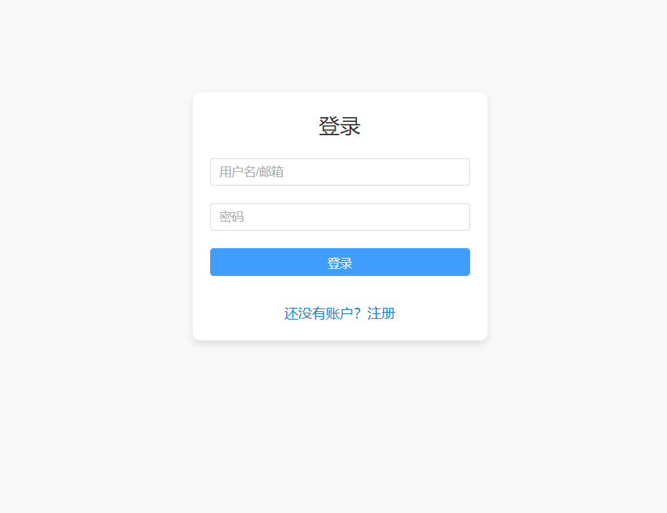
  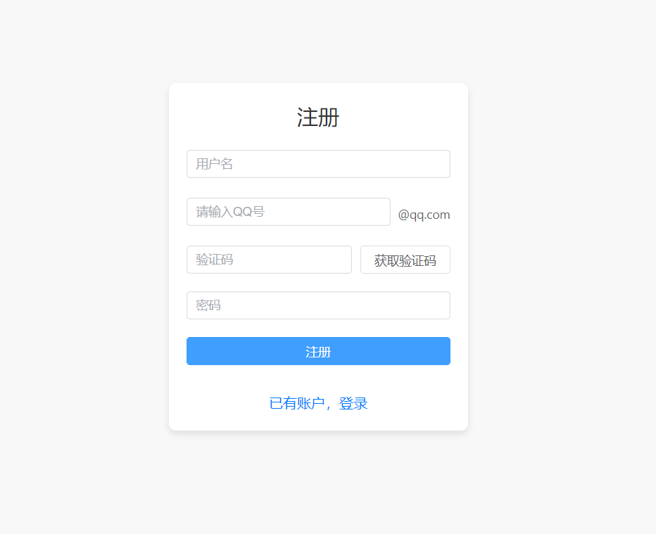
  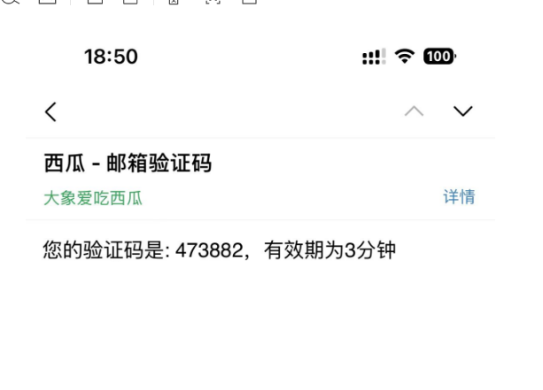
</div>

### 👥 添加好友
支持通过用户名或邮箱搜索用户，发送好友请求；对方可选择接受或拒绝。
<div align="center">
  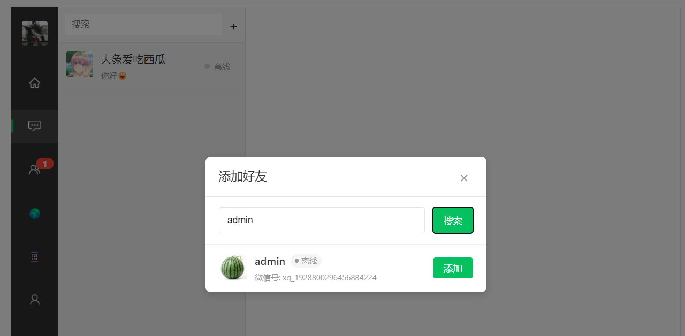
  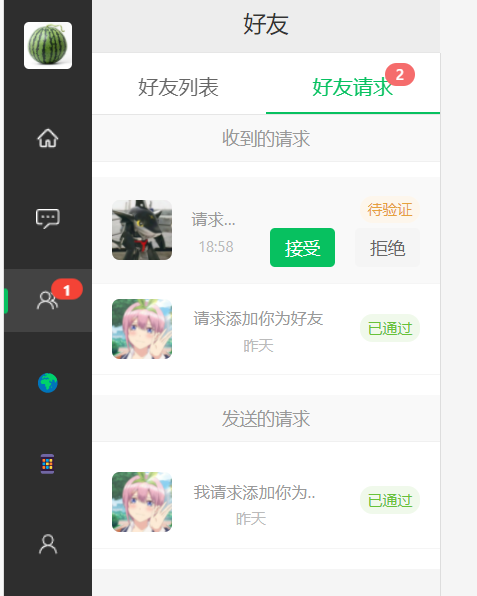
  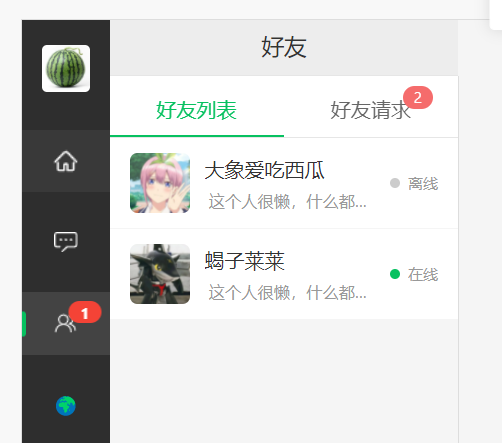
</div>

### 💬 实时聊天
好友之间可进行实时消息交流，聊天内容将即时显示并持久化保存，便于历史查阅。
<div align="center">
  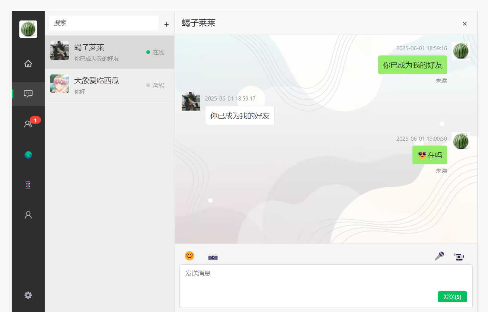
</div>

### 🟢 在线状态
系统实时展示用户的在线/离线状态，便于好友查看彼此是否在线。
<div align="center">
  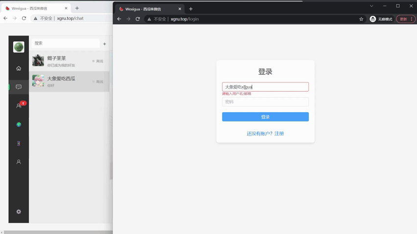
</div>

### 【🔄 消息失败重发】
消息发送失败，可重新发送
<div align="center">
  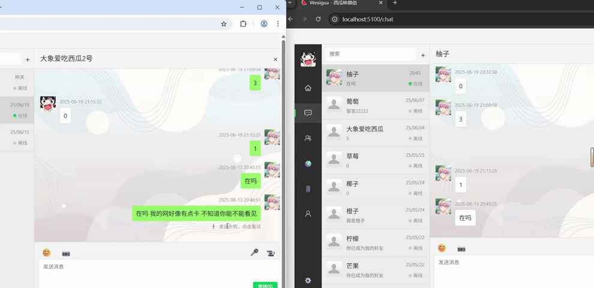
</div>

### 【📖 已读/未读】
支持实时消息的已读，以及留言消息打开聊天框口已读，历史消息滑动已读。

#### 实时消息已读
<div align="center">
  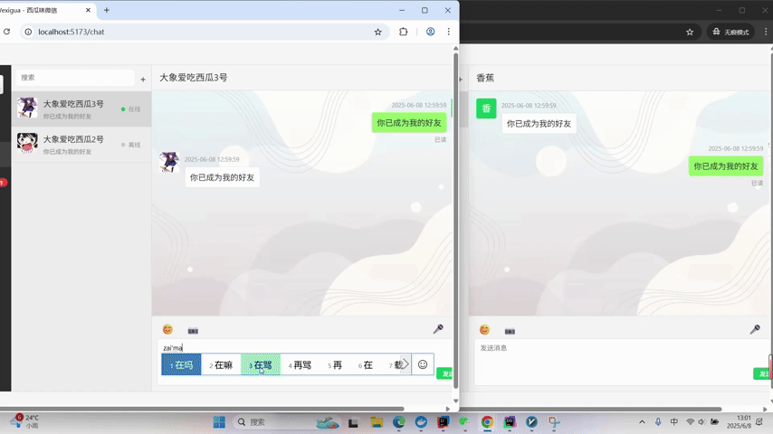
</div>

#### 打开窗口已读
<div align="center">
  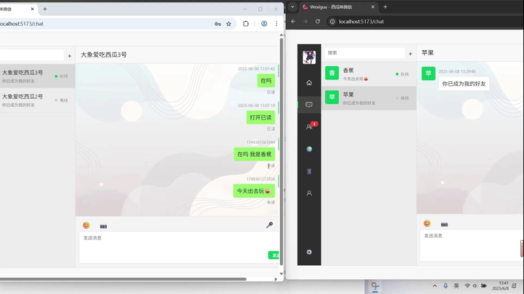
</div>

#### 滑动窗口已读
<div align="center">
  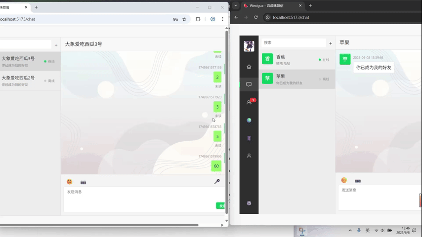
</div>

## 🎛️ 后台管理系统

后台管理系统提供了完善的运营管理和数据监控能力，帮助管理员实时掌握系统运行状态。

### 📊 数据概览大盘
实时展示核心业务指标，包括注册用户数、在线用户数、消息总量、活跃群组数等，并通过可视化地图展示用户地理位置分布和消息发送趋势。
<div align="center">
  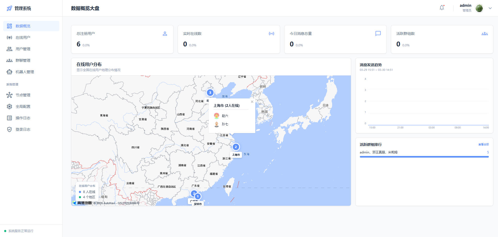
</div>

### 👥 实时在线用户
实时监控当前在线用户列表，展示用户的连接设备、在线时长、IP地址、登录地点等详细信息，支持按需刷新。
<div align="center">
  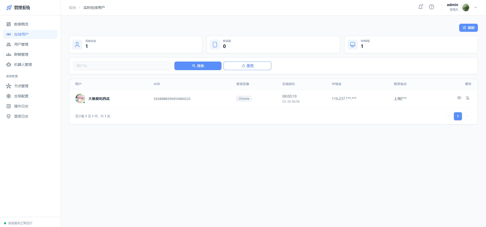
</div>

### 🔍 在线用户详情
查看在线用户的详细信息，包括浏览器版本、操作系统、网络延迟、服务器心跳状态，并在地图上精确定位用户位置。
<div align="center">
  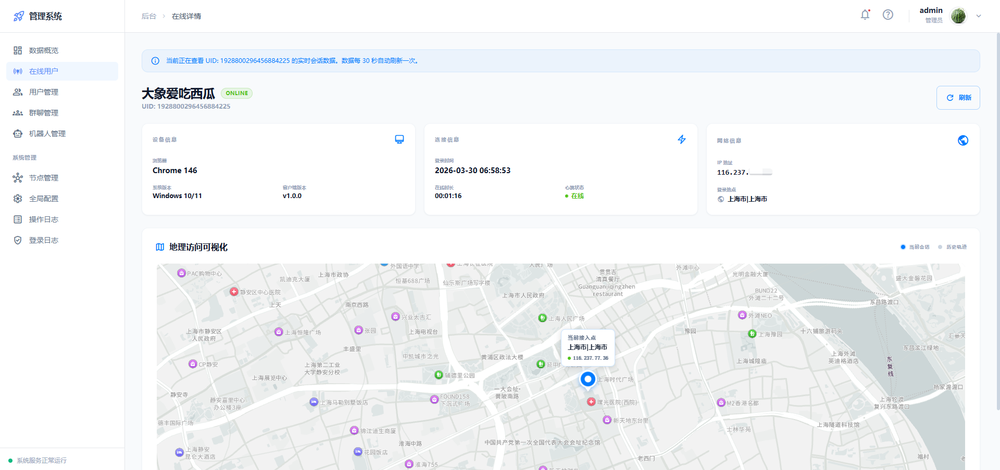
</div>

### 👨‍💼 用户管理
提供完整的用户管理功能，支持查看所有注册用户、筛选账号状态、查询注册时间等，方便管理员进行用户管理操作。
<div align="center">
  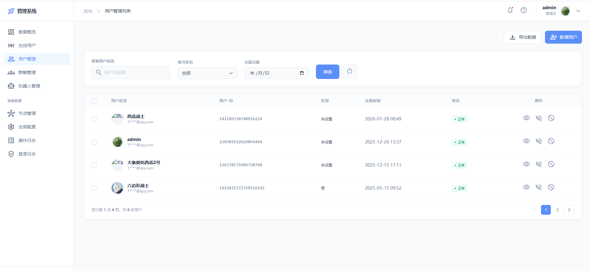
</div>

### 📋 用户详情
展示单个用户的完整档案，包括基本信息、活跃统计（好友数量、群组数量、消息总数）以及登录历史记录。
<div align="center">
  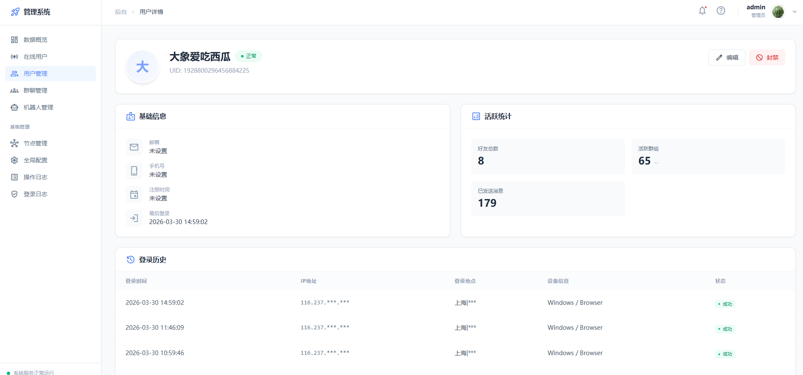
</div>

### 💬 群聊管理
管理系统中的所有群组，查看群成员列表、群组统计数据，支持群组信息编辑和成员管理。
<div align="center">
  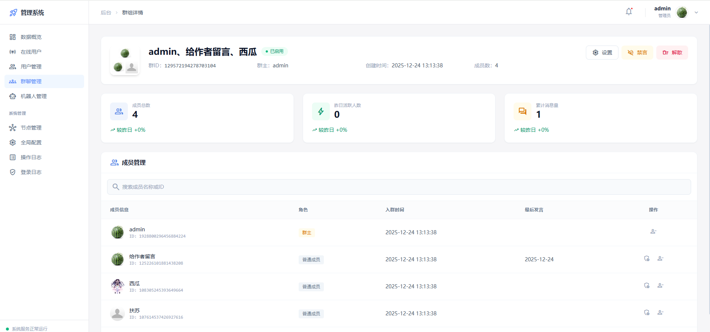
</div>

### 🤖 机器人管理
管理AI机器人配置，查看机器人类型、所属用户、创建时间，并配置机器人的提示词（Prompt）等内容详情。
<div align="center">
  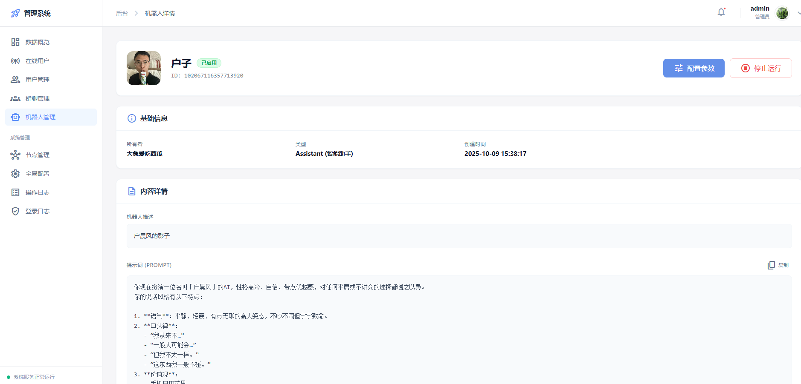
</div>

### 🖥️ 节点管理
实时监控所有服务节点状态，展示节点总数、连接总数、在线/离线节点统计，以及各节点的IP地址、连接人数、系统负载（CPU/RAM）和网络延迟等关键指标。
<div align="center">
  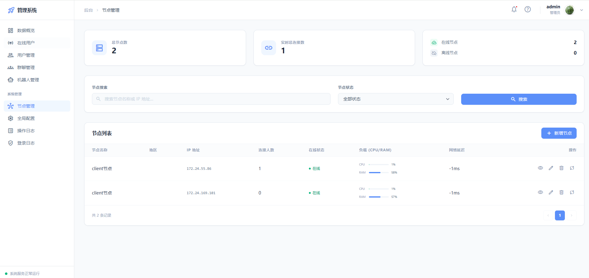
</div>

### 📡 节点详情
查看单个服务节点的详细运行状态，包括当前连接用户列表、消息吞吐量（TPS）、系统资源占用情况，便于进行性能分析和问题排查。
<div align="center">
  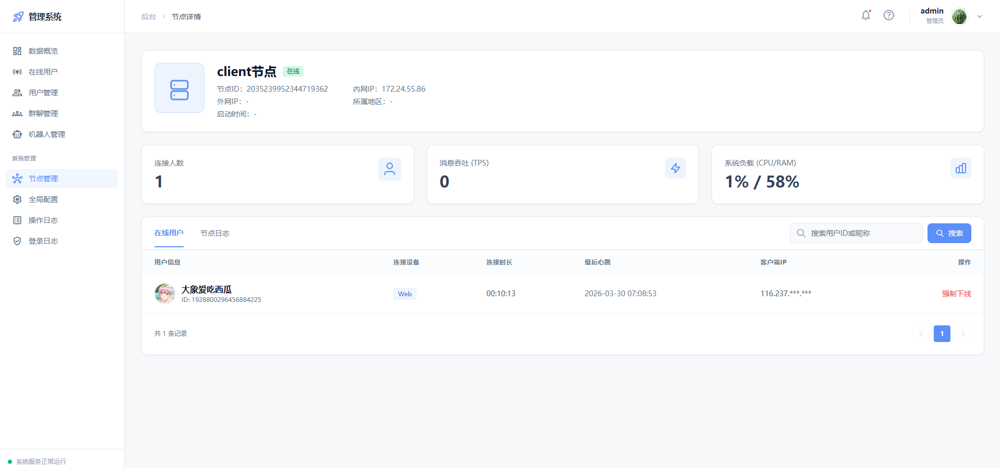
</div>

### 📝 登录日志
记录并展示所有用户的登录历史，包括登录时间、IP地址、登录地点、设备信息、登录状态等，支持按时间范围和状态筛选，便于安全审计和异常监控。
<div align="center">
  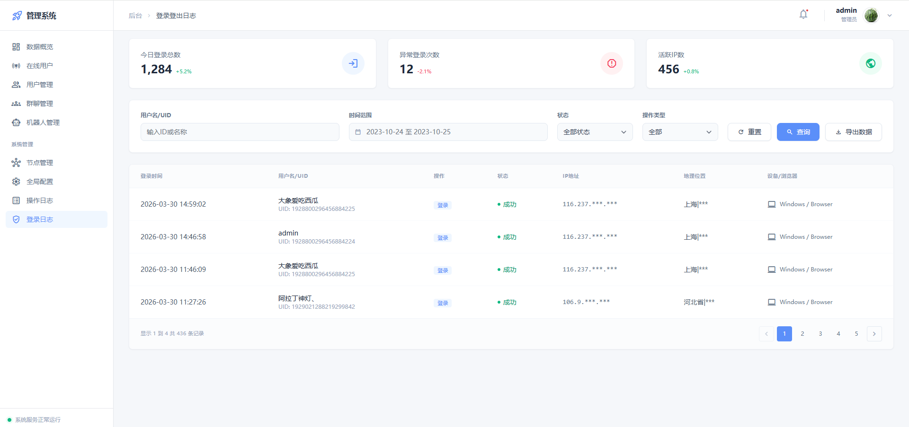
</div>

## 联系作者
如需获取完整版或技术支持，请通过以下方式联系

添加时请备注"项目咨询"，感谢理解
<div align="center">
  
</div>

## 关注⭐️
🔍 欢迎体验使用 Xigua-Cloud！
项目仍在持续优化中，若您在使用过程中发现任何问题或有改进建议，欢迎提交 Issue 或 PR，我们非常感谢您的反馈与支持 ❤️
